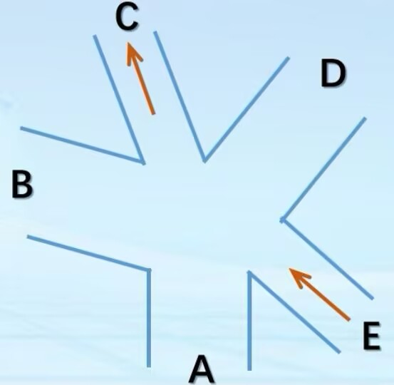
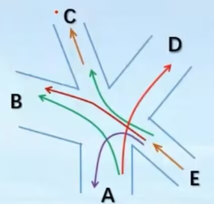
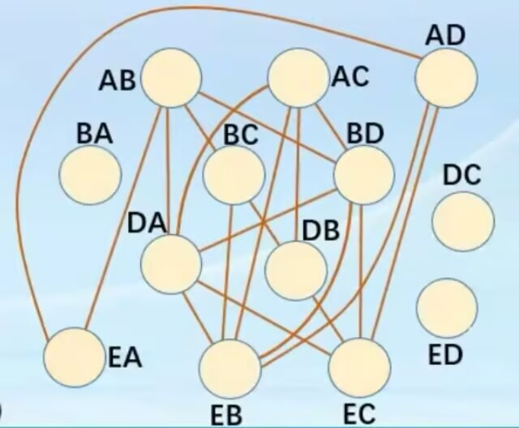
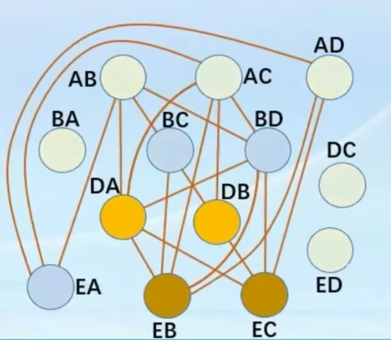
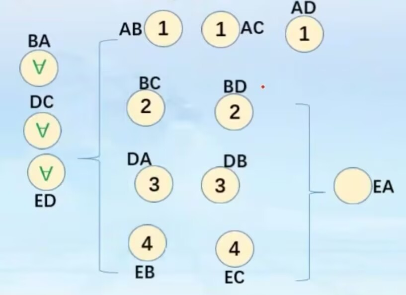

# five-cross-traffic-light
多岔路口交通管理，图着色算法实现五岔路口信号灯相位分配

# 题目要求：
       给出一个五岔路口，其中C 和 E 为单行道，共有 13 条可通行路线。有的不可同时通行，如 E → B 和 A → D ；但有的可以同时通行，如 A → B 和 E → C。
      如何设置交通灯进行该路口车辆通行管理呢？ 
      
 

## 项目介绍
       本项目对五岔路口信号灯配时问题进行建模，将交通路线冲突问题转化为图论的图着色问题，使用贪心着色算法求出信号灯相位分组，得到安全可行的放行方案。

## 解决方案
  1. **问题分析**
     
        题目需要对多条车流路线划分相位。核心约束 : **存在交叉冲突的两条路线不能在同一相位同时放行** ; BA、DC、ED路线与所有车流均无冲突，可以永久放行，不参与相位切换。
        我们需要把剩下的路线划分成若干组，每组内部路线互不冲突，每组对应一个信号灯相位，轮流放行。
  2. **建立图模型**
     
        把每一条通行路线当作图的一个顶点。
        如果两条路线存在车流交叉、会发生冲突，就在两个顶点之间连一条边。有边相连代表两个顶点不能分到同一组（不能同色）。当 AB、AC、AD不放行时 EA 单独拎出来，不加入图中，作为常绿路线。
    
     
  3. **冲突矩阵构建**
     
        根据路口车流交叉关系，写出冲突矩阵：若路线i和路线j冲突，则 conflict[i][j]=1 ,否则为0。这个矩阵用来判断任意两条路线能否同时放行。
  4. **贪心图着色算法求解分组**
     
        依次遍历所有路线顶点，给顶点分配颜色（相位编号）：
        - 检查当前顶点所有已经着色的相邻冲突顶点；
        - 排除相邻顶点已经使用过的颜色；
        - 选择最小可用颜色分配给当前顶点；
        - 相同颜色的顶点属于同一个相位，可以同时放行。
       
   5. **特殊路线合并**
       
        当 AB、AC、AD不放行时 EA 与其他路线无冲突，不参与着色分组。在最终输出时，EA追加到除AB、AC、AD所在相位的每一个相位中，保持常绿放行。
   6. **输出结果**
       
        按颜色分组，依次输出每个相位可以放行的路线，得到整套信号灯轮换方案。
      
      
## 运行环境
C++，支持C++11及以上编译器（Dev-C++ / VS / g++均可）

## 文件说明
- `traffic.cpp`：源代码文件，实现图着色算法，输出各相位放行路线
- `README.md`：项目说明文档
